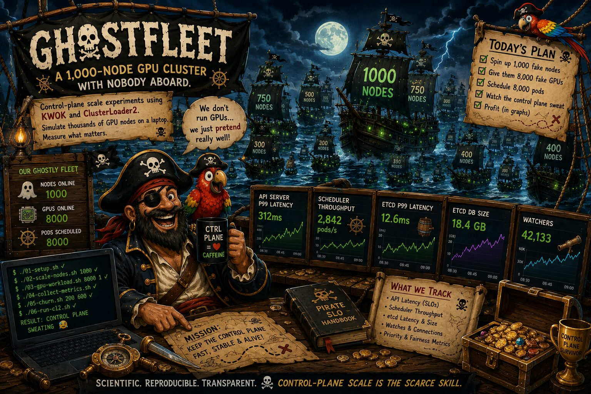
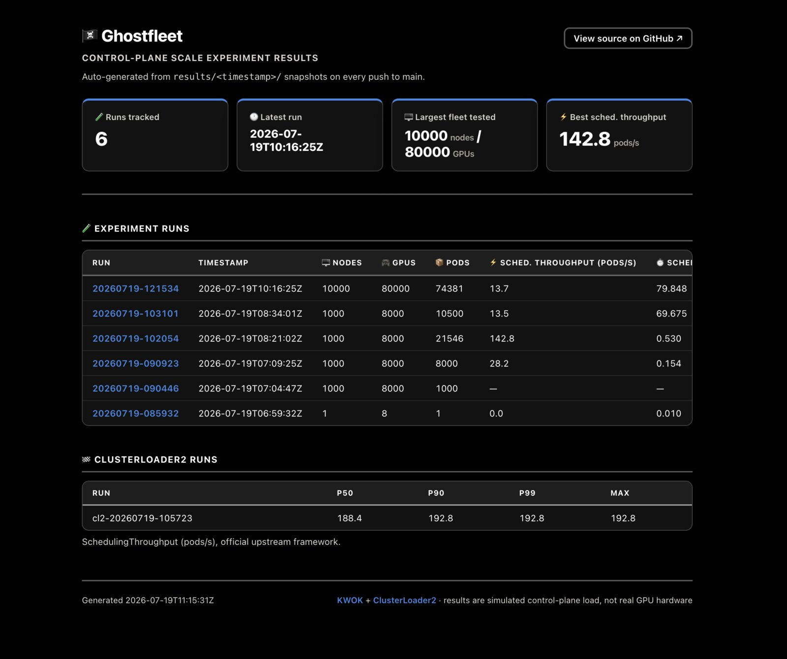
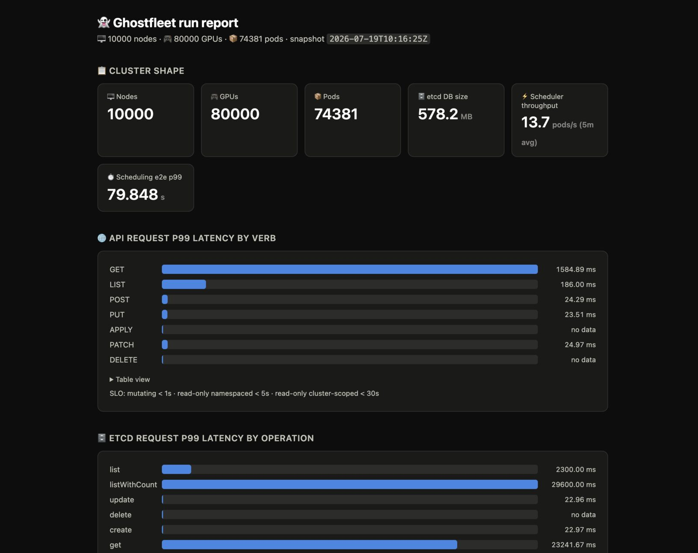

# Ghost Fleet 🏴‍☠️
[](https://github.com/hiteshsahu/ghostfleet/actions/workflows/pages.yml)


> GhostFleet simulates a 1,000 node / 8,000-GPU Kubernetes cluster on a laptop using
`KWOK`, load it with `ClusterLoader2` and a custom GPU scheduling workload, and measure how the control
plane behaves.


> A 1,000s of node GPU cluster with nobody aboard.
>
> 


I wanted to study limits of Kubernetes on real GPU cluster at super scale like in DGX Data servers with thousands of GPU used by millions of users but that is not possible because

- I have no access to a real prod DGX GPU cluster
- I cant aford one, obviously :)

So I created this simulation where I spin off my fleet with thousands of nodes with 8 GPU virtual gpu each that can run my GPU load of k8 pods. 

This helps me test the limits of Kubernetes at hyper scale like in a real world GPU heavy cluster running workloads similar to CLaud or CHATGPT

See real test results on [GitHub Pages](https://hiteshsahu.github.io/ghostfleet/)

[](https://hiteshsahu.github.io/ghostfleet/)

### **Why simulate?** 

The scarce skill in AI infrastructure isn't running GPUs
it's knowing how the control plane behaves when there are thousands of them.

KWOK is the simulator SIG-Scalability itself uses to study control-plane scale
without hardware; this repo uses it to run honest, reproducible experiments
against the upstream scalability SLOs.

---

## ⚡ Quickstart

### 🛠 Prereqs
Docker or Podman running, kubectl, jq, go (for CL2). 8GB+ RAM free.

### 📟 Go CLI

Start by cloning the repo and running the `go` script in the root directory.

### ⚙️ Install dependencies

Installs kwokctl if missing, then creates the KWOK cluster + Prometheus. (ClusterLoader2 is cloned separately, on first `./go cl2` run.)

Need to run each time after clean up.


```bash
# 🏗️ Install dependencies and create the KWOK cluster + Prometheus
./go setup  
```

You can check dependencies with:

```bash
# ⚙️ verifies the tool are installed
./go check_tools           
```

### ▶️ Run

Start the fleet, load it with pods.

```bash
# 🖥️ Create N fake GPU nodes (8x nvidia.com/gpu each)
./go nodes 1000            # creates 1,000 fake GPU nodes (8x nvidia.com/gpu each node)

# 📦 Schedule pods requesting GPUs
./go load 8000 1           # schedules 8,000 pods requesting 1 GPU; times it

# 🌊 Stir the seas : Sustained create/delete pressure (APF / etcd / watches)
./go churn 200 600         # Generate 200 pods/sec churn for 600s(10 minutes) :: experiment D
./go churn_limited 200 600 # Same, but rate-limited (bounded concurrency + request-timeout) — see docs/findings.md
```

```bash

# 📡 Check on the fleet
./go status                # Control plane health, node/GPU counts, pod scheduling status
```

OUTPUT:

```bash
hitesh@Mac ghostfleet % ./go status

📡 Fleet status — cluster: ghostfleet

🐳 Control plane containers:
  kwok-ghostfleet-etcd: Up 35 minutes
  kwok-ghostfleet-kube-apiserver: Up 35 minutes
  kwok-ghostfleet-kwok-controller: Up 35 minutes
  kwok-ghostfleet-kube-scheduler: Up 35 minutes
  kwok-ghostfleet-kube-controller-manager: Up 35 minutes
  kwok-ghostfleet-prometheus: Up 35 minutes

✅ apiserver reachable

🖥️  Nodes:
  1000/1000 Ready, 8000 GPUs allocatable

📦 Pods:
  (no gpu-load/churn namespaces yet — run ./go load or ./go churn)

📊 Prometheus: http://127.0.0.1:9090

```


### 🧪 Test & Benchmark

Benchmark the control plane with ClusterLoader2, which runs the official Kubernetes density benchmark.

```bash
# 🧪 Official Kubernetes benchmark
./go cl2                   # Run the ClusterLoader2 density benchmark :: experiment E

# 🧹 Scuttle the fleet
./go clean                 # Delete the cluster and clean up

```

### 📊 Observability

Prometheus starts at: http://127.0.0.1:9090 (started by kwokctl).

Snapshot the metrics

```bash
# 📸 Dump SLO metrics from Prometheus into results
./go snapshot             

# 📄 Render the latest (or a given) snapshot as a self-contained HTML report
./go report               
./go report results/20260719-090923
```

[](https://hiteshsahu.github.io/ghostfleet/)


Every push to `main` that touches `results/**` also publishes a browsable index of
every run's report to GitHub Pages (see `.github/workflows/pages.yml` and
`scripts/08-build-pages.sh`) — one-time setup: Settings → Pages → Source: GitHub Actions.

**Key metrics / PromQL cheat sheet**

```bash
# API p99 latency by verb (the SLO chart)
histogram_quantile(0.99, sum(rate(apiserver_request_duration_seconds_bucket{verb!~"WATCH|CONNECT"}[1m])) by (verb, le))

# Scheduler throughput (pods scheduled per second)
sum(rate(scheduler_schedule_attempts_total{result="scheduled"}[1m]))

# End-to-end scheduling latency p99
histogram_quantile(0.99, sum(rate(scheduler_pod_scheduling_sli_duration_seconds_bucket[5m])) by (le))

# etcd request latency + DB size
histogram_quantile(0.99, sum(rate(etcd_request_duration_seconds_bucket[1m])) by (operation, le))
etcd_mvcc_db_total_size_in_bytes

# Priority & Fairness: are requests queuing/rejected?
sum(rate(apiserver_flowcontrol_dispatched_requests_total[1m])) by (priority_level)
sum(rate(apiserver_flowcontrol_rejected_requests_total[1m])) by (priority_level, reason)
histogram_quantile(0.99, sum(rate(apiserver_flowcontrol_request_wait_duration_seconds_bucket[1m])) by (priority_level, le))

# Watch pressure
sum(apiserver_registered_watchers) by (kind)

# Inflight requests vs limits
sum(apiserver_current_inflight_requests) by (request_kind)
```

---

###  [KWOK](https://kwok.sigs.k8s.io/) ::  *K*ubernetes *W*ith*O*ut *K*ubelet


Ghost fleet runs control-plane scale experiments against a simulated GPU cluster, using
- [KWOK](https://kwok.sigs.k8s.io/)
- [ClusterLoader2](https://github.com/kubernetes/perf-tests/tree/master/clusterloader2).

Hypotheses in [docs/experiment-design.md](./docs/experiment-design.md), numbers in [docs/findings.md](./docs/findings.md), narrative write-up in [docs/writeup.md](./docs/writeup.md), raw data in [./results/](./results/).

KWOK runs a **real** kube-apiserver, etcd, scheduler, and controller-manager
(via `kwokctl`, using Docker or Podman).

The *nodes* and *pod lifecycles* are faked by the
kwok controller
- Emulates nodes heartbeat, pods go Pending → Running instantly, but no
  kubelet, no containers, no real GPUs.
- Fakes kubelet, CNI/CSI, device plugin gRPC, DCGM, actual GPU
  allocation.

---

## What will probably break 

1. `kubectl apply` of 1,000 node manifests crawls → client-side throttling.
   Fix: single concatenated manifest + server-side apply, or raise client QPS.
   *Interview story: "first bottleneck at scale is usually the client."*
2. Creating 8,000 pods via one Deployment: controller-manager's own client QPS
   (`--kube-api-qps`, default 20) rate-limits pod creation — the scheduler ends
   up starved, not slow. Distinguish "scheduler is slow" from "scheduler is
   underfed" using `scheduler_pending_pods` vs attempt rate.
3. Prometheus itself becomes a load source at high churn (watch + scrape).
4. At tight bin-packing (run C), watch scheduling latency p99 climb as feasible
   nodes become scarce — filtering does more work per pod.

---

## 📁 Folder Structure

```
    .
    │
    ├── scenarios/          # ClusterLoader2 configs and workload definitions
    │   ├── density/
    │   └── workloads/
    │
    ├── manifests/          # Fake GPU node templates and Kubernetes manifests
    │
    ├── dashboards/         # Grafana dashboards
    │
    ├── scripts/            # Imperative execution — setup, scale, load, churn,
    │   │                   # snapshot, HTML report, CL2 runner, Pages site build
    │   └── templates/      # Shared HTML/CSS templates for the Pages site
    │
    ├── results/            # Raw benchmark snapshots (committed on purpose)
    │
    ├── docs/
    │   ├── experiment-design.md
    │   ├── findings.md
    │   ├── writeup.md
    │   └── writeup-template.md
    │
    ├── .github/workflows/  # Publishes results/ to GitHub Pages on every push
    │
    ├── go
    ├── README.md
    └── LICENSE
```
